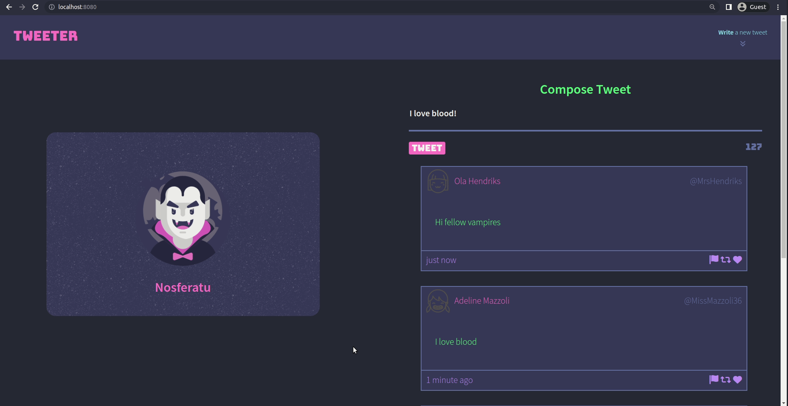
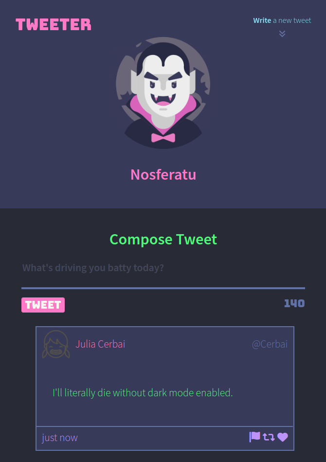
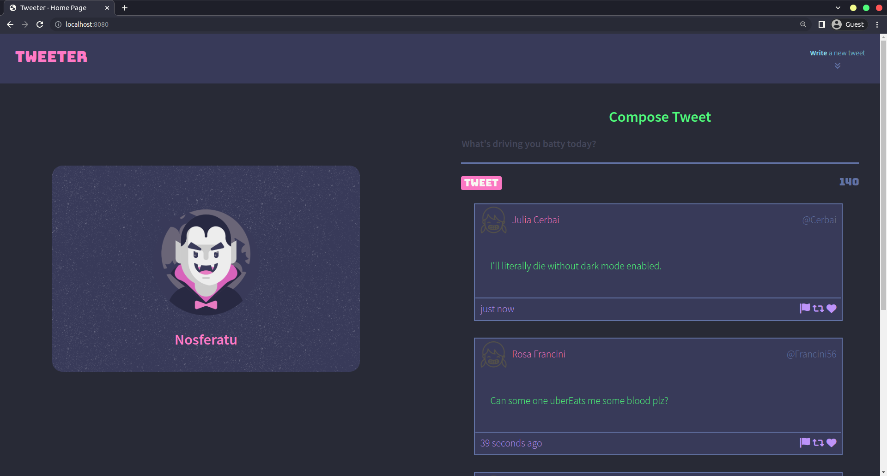

# Tweeter Project

Tweeter is a simple, single-page Twitter clone. The theme of my Tweeter is based off of my personal favourite dark mode theme [Dracula](https://draculatheme.com/).

## Screenshots

## Getting Started

1. Fork this repository
2. Clone your repository onto your local device.
3. Install dependencies using the `npm install` command.
3. Start the web server using the `npm run local` command. The app will be served at <http://localhost:8080/>.
4. Go to <http://localhost:8080/> in your browser.

## Dependencies

- Express
- Node 5.10.x or above
- Body-parser
- md5
- timeago.js
